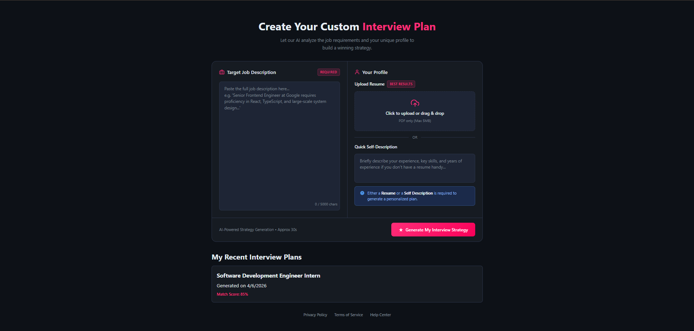
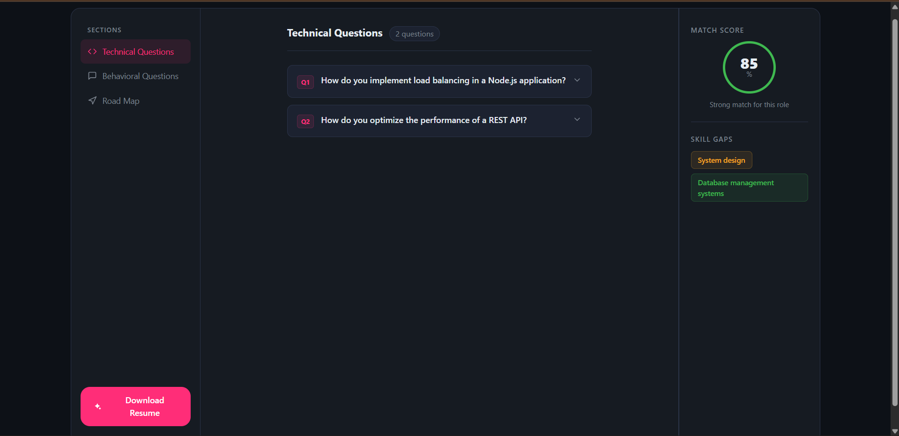
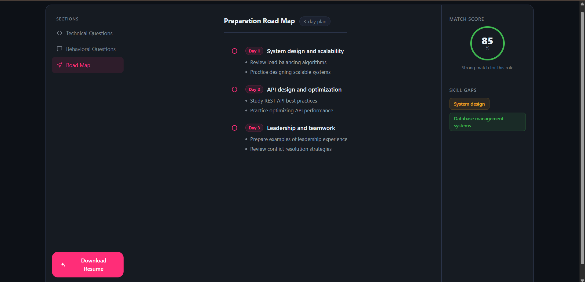

<div align="center">

# 🎯 HireEdge
### AI-Powered Interview Preparation Platform

[](https://hiredge.vercel.app)
[](https://hiredge.onrender.com)
[](LICENSE)

**HireEdge analyzes job descriptions and your profile to create 
personalized interview strategies using AI.**

[Live Demo](#) • [Features](#features) • [Setup](#setup) • [Screenshots](#screenshots)

</div>

---

## ✨ Features

- 🤖 **AI-Generated Questions** — Technical & behavioral questions tailored to the job
- 📊 **Match Score Analysis** — Know how well you fit the role
- 🗺️ **Day-wise Preparation Roadmap** — Structured plan to ace the interview
- 🔍 **Skill Gap Analysis** — Identify what you need to improve
- 📄 **ATS-Friendly Resume** — AI generates a resume tailored for the job
- 🔐 **Secure Authentication** — JWT-based auth with httpOnly cookies
- 📱 **Responsive Design** — Works on all devices

---

## 🖥️ Screenshots

<!-- Add screenshots after deployment -->
| Home Page | Interview Report | Roadmap |
|-----------|-----------------|---------|
|  |  |  |

---

## 🛠️ Tech Stack

**Frontend:**


**Backend:**


**AI & Others:**


---

## 🏗️ Architecture
```
HireEdge/
├── frontend/                 # React + Vite
│   ├── src/
│   │   ├── features/
│   │   │   ├── auth/         # Login, Register, Protected routes
│   │   │   └── interview/    # Home, Interview report pages
│   │   ├── styles/           # Global SCSS
│   │   └── App.jsx
│   └── package.json
│
└── backend/                  # Node.js + Express
    ├── src/
    │   ├── controllers/      # Route handlers
    │   ├── services/         # AI service, business logic
    │   ├── models/           # Mongoose schemas
    │   ├── middlewares/      # Auth, file upload, rate limit
    │   ├── routes/           # API routes
    │   └── config/           # Database config
    └── package.json
```

---

## 🚀 Setup & Installation

### Prerequisites
```bash
Node.js >= 18.0.0
MongoDB
Groq API Key (free at console.groq.com)
```

### 1. Clone the repository
```bash
git clone https://github.com/your-username/HireEdge.git
cd HireEdge
```

### 2. Backend Setup
```bash
cd backend
npm install
```

Create `.env` file:
```bash
MONGO_URI=your_mongodb_uri
JWT_SECRET=your_jwt_secret
GROQ_API_KEY=your_groq_api_key
NODE_ENV=development
PORT=3000
ALLOWED_ORIGINS=http://localhost:5173
```
```bash
npm run dev
```

### 3. Frontend Setup
```bash
cd frontend
npm install
```

Create `.env` file:
```bash
VITE_API_BASE_URL=http://localhost:3000
```
```bash
npm run dev
```

### 4. Open in browser
```
http://localhost:5173
```

---

## 🔌 API Endpoints

### Auth Routes
| Method | Endpoint | Description | Access |
|--------|----------|-------------|--------|
| POST | `/api/auth/register` | Register new user | Public |
| POST | `/api/auth/login` | Login user | Public |
| POST | `/api/auth/logout` | Logout user | Public |
| GET | `/api/auth/get-me` | Get current user | Private |

### Interview Routes
| Method | Endpoint | Description | Access |
|--------|----------|-------------|--------|
| POST | `/api/interview/` | Generate interview report | Private |
| GET | `/api/interview/` | Get all reports | Private |
| GET | `/api/interview/report/:id` | Get report by ID | Private |
| POST | `/api/interview/resume/pdf/:id` | Generate resume PDF | Private |

---

## 🔒 Security Features

- ✅ JWT Authentication with httpOnly cookies
- ✅ Rate limiting on all endpoints
- ✅ Input validation & sanitization
- ✅ Helmet security headers
- ✅ CORS protection
- ✅ File type & size validation
- ✅ MongoDB injection prevention
- ✅ Token blacklisting on logout

---

## 🌐 Deployment

| Service | Platform | URL |
|---------|----------|-----|
| Frontend | Vercel | https://hiredge.vercel.app |
| Backend | Render | https://hiredge.onrender.com |
| Database | MongoDB Atlas | Cloud |

---

## 🤝 Contributing
```bash
1. Fork karo
2. Branch banao  → git checkout -b feature/AmazingFeature
3. Commit karo   → git commit -m 'Add AmazingFeature'
4. Push karo     → git push origin feature/AmazingFeature
5. Pull Request  → Open a PR
```

---

## 📝 License
```
ISC License — Karan Kumar
```

---

<div align="center">

**⭐ Agar project achha laga toh star do!**

Made with ❤️ by [Karan Kumar](https://github.com/KaranKumar282828)

</div>
